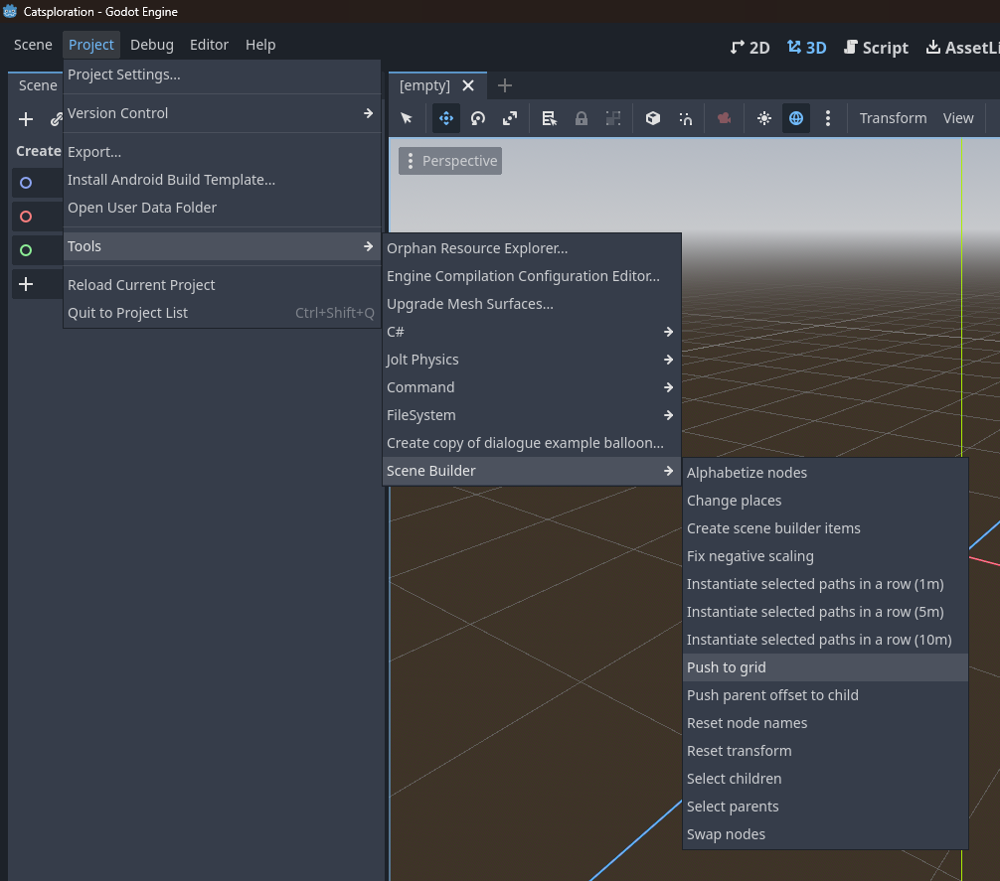
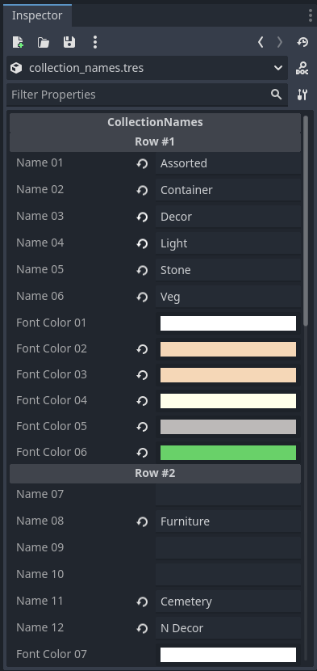
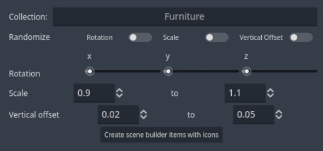

# Introduction

SceneBuilder is a system for efficiently building 3D scenes in Godot.

Scene builder is logically divided into two main parts: scene builder commands and the scene builder dock.

## Shortcuts

Shortcuts are hardcoded into SceneBuilder.

Mosts shortcuts require a combination of `Alt` and another key, though in some cases we use `Shift` or `Ctrl`. 

Although SceneBuilder does conflict with some of Godot's less-useful shortcuts, we try to stay out of Godot's way. For the most part, Godot doesn't make use of the `Alt` modifier, so we are free to fill out the keyboard with our own shortcuts that use this modifier.

Please see sections "Scene builder commands" and "The scene builder dock" for specific shortcut information.

Note: I recommend unbinding the default shortcuts: 
	
	* Quit, Ctrl + Q
	* (todo)

## Scene builder commands

In Godot's main bar, click `Project > Tools > Scene Builder` to see a list of productivity commands with their associated keyboard shortcuts.

If you would like to know more about how these commands work, please see the command's respective GDScript file for more information, which is located,

	`res://addons/SceneBuilder/Commands/`

Implementation details: The script `scene_builder_commands.gd` is loaded by `scene_builder_plugin.gd`, which is the class registered to EditorPlugin via `plugin.cfg`. The script `scene_builder_commands.gd` adds commands to the Godot toolbar and also listens for keyboard shortcuts. Each command's implementation is contained within the command's respective GDScript file.

## The scene builder dock

The scene builder dock requires manual setup. This isn't an ideal user experience, but doing things this way leads to very simple and stable solutions, please bear with us!

In order to set-up the scene builder dock, follow these steps,

### Initialize your data folder

1. Create an empty folder,

	`res://Data/SceneBuilderCollections`

Note: This folder path is hard coded into the scene builder dock.

2. Create a CollectionNames resource at the following location by first creating a new Resource, then by attaching the script: `scene_builder_collections.gd`,

	`res://Data/SceneBuilderCollections/collection_names.tres`

This resource path is hard coded into the scene builder dock.

3. Enter your desired collection names into the CollectionNames resource, then create empty folders with matching names.

For example, if you would like a collection named "Furniture," then write "Furniture" in the CollectionNames resource. Next, create an empty folder "Furniture" at location, 

	`res://Data/SceneBuilderCollections/Furniture/`

Your data folder is now initialized.

If you have a folder in `res://Data/SceneBuilderCollections/` that is not listed in the CollectionNames resource, then it will simply be ignored. Conversely, if a collection name is written in CollectionNames, then an error will occur if a matching folder is not found.

The scene builder dock only provides space for 12 collections, however, you can make additional folders. We can update which 12 collections are currently in use by swapping out names in the CollectionNames resource, then hitting the "Reload all items" button on the scene builder dock. The decision to have 12 collections was an arbitrary one, though it does fit nicely into the UI dock.

You can enable the plugin now to preview your collection names in the scene builder dock. However, since our collection folders are empty, you will see a harmless error: `Directory exists, but contains no items: Furniture`.

### Manually create one item

Usually, we will want to create `SceneBuilderItem` resources in bulk. However, for demonstration purposes, let us create our first item manually.

Continuing with the furniture example, we assume in this section that you have already added "Furniture" to collection names, and have created an empty "Furniture" folder,

1. Create a `PackedScene` that we will use as an item to place. For this example, I will assume that you already have "Chair.glb" or "Chair.tscn" somewhere in your project files. It doesn't matter where your chair scene is located in FileSystem.

Note that the scene builder dock will only work with files ending in .glb or .tscn.

Also note that the root node of imported scenes must derive from Node3D.

2. Create two sub folders "Item" and "Thumbnail" at locations,

	`res://Data/SceneBuilderCollections/Furniture/Item/`
	`res://Data/SceneBuilderCollections/Furniture/Thumbnail/`

3. Create a new resource at the following location, then attach the script `scene_builder_item.gd` to it,

	`res://Data/SceneBuilderCollections/Furniture/Item/Chair.tres`

By convention, the SceneBuilderItem resource should have the same name as the corresponding PackedScene, though it does not matter.

4. Create an icon at the following location,

	`res://Data/SceneBuilderCollections/Furniture/Thumbnail/Chair.png`

by convention, a png file with a name matching the item name should be placed in the Thumbnail folder, though the location and name does not actually matter. Icons are not resized, so they should be around 79x79 pixels in order to fit in the dock. A temporary icon is included at location `res://addons/SceneBuilder/icon_tmp.png` for demonstration. In the next section, we automatically generate icons instead.

5. Fill out fields in the SceneBuilderItem resource (Chair.tres for this example),

- Collection name would be "Furniture" in this example
- Item name can be anything, but by convention is the same as the base of the path name. The item name would be "Chair" in this example.
- Scene path is the path to Chair.glb (or Chair.tscn).
- Do not edit fields in the Hidden group. (Todo: does Godot have @export_hidden yet?)

Our chair item is now ready!

Note that the result of scene path being a field of a given SceneBuilderItem instance is that if the item PackedScene is moved around in FileSystem, then the PackedScene will no longer be found by SceneBuilder. Todo: How can we update paths when moving PackedScene files? For now, we should manually update scene path fields, or simply delete then recreate SceneBuilderItem resources in bulk.

Although we demonstrate how to automatically generate items and icons in the next section, once a SceneBuilderItem is made, it must be edited by hand for any further changes.

### Batch create items

1. Select paths in FileSystem that contain an imported scene with a root node that derives from type Node3D. These paths must end in either .glb or .tscn.
2. Run the "Create scene builder items" command by going to Project > Tools > Scene Builder > Create scene builder items, or by pressing the keyboard shortcut Alt + /
3. Fill out the fields in the popup window, then hit okay.

4. When the command "Create scene builder items" is run, the scene icon_studio will be opened. Please close the scene when it's done without saving changes to icon_studio.tscn.

However, if you would like to make changes to icon_studio.tscn, then that's a great way to customize your icons.

5. In the scene builder dock, click the button "Reload all items"

### Update the scene builder dock

#### World3D

The scene builder dock needs to know which scene it should be placing items into. This is not done automatically. 

When the plugin first loads, it will attempt to use the currently active scene. 

We can change the scene used by the scene builder dock by clicking on that scene's tab, then clicking on the "Find world 3d" button in the scene builder dock.

#### Scene builder items

Whenever we make changes to SceneBuilderItem resources or collection names, we must then press the "Reload all items" button on the scene builder dock.

### Placement mode

When an icon is highlighted green in the scene builder dock, then placement mode has been enabled.

To exit placement mode, we may: press the highlighted icon, (Todo: also end placement mode on Esc? On Right-click?)

When placement mode is active, then there will be an item preview in the current edited scene. 

Note that a "SceneBuilderTemp" of type Node will be created in the current edited scene. We may safely delete this node when we are done.

#### Use surface normal

Instantiated items will use the surface normal instead of their original orientation.

(Todo: shortcut? add other normal types?)

#### Rotation mode

Press z, x, or c to enter rotation mode, where c represents the y-axis. Rotation will be applied in local or world space according to the editor's "Use Local Space" setting.

While rotation mode is active, mouse movement will rotate the preview item around the x, y, or z axis, depending on which key was pressed.

To exit rotation mode: left click to apply the rotation or right-click to cancel and restore the original rotation.

#### Scale mode

Press v to enter scale mode. While scale mode is active, mouse movement will increase or decrease the scale of the preview item.

To exit scale mode: left click to apply or right-click to cancel and restore the original values.

