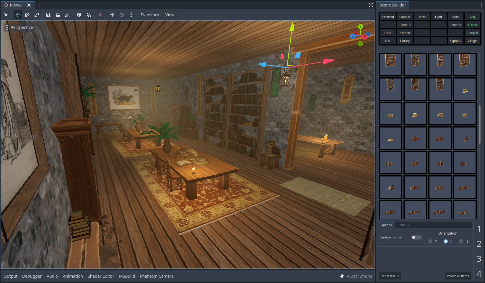
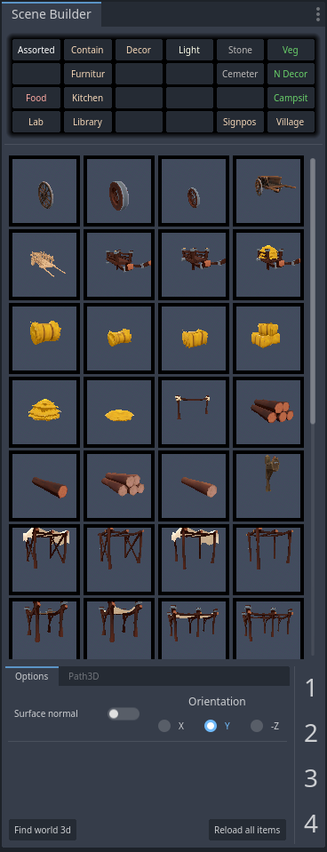
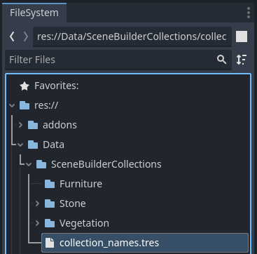
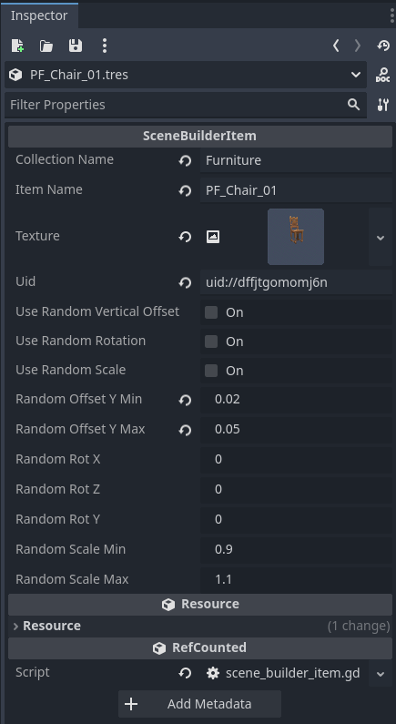

# Introduction

SceneBuilder is a 3D level design tool and asset browser, together with a set of common productivity commands

Scene builder is logically divided into two main parts: scene builder commands and the scene builder dock.

**Bugs** Since I use this tool for my own games, any form of collaboration, bug reports, or new feature suggestions are greatly appreciated. Please join us in Discord, or make a post in Github's Issues section.

### Scope

Scene builder is made to serve as a scene browser and scene placer for scenes of type Node3D. Scene builder also aims to offer a handful of productivity commands.

#### Multi-mesh Instances

Scattering large numbers of objects, often with help from multi-mesh instances, is currently out of scope. Please see one of the specialized tools below,

- [Scatter](https://github.com/HungryProton/scatter) is a powerful tool designed to randomly fill areas with props or other scenes.
- [Simple Grass Textured](https://github.com/IcterusGames/SimpleGrassTextured) is the perfect tool for painting 2d textures over a collision area.
- [Spatial Gardener](https://github.com/dreadpon/godot_spatial_gardener) is an efficient tool that uses an octree to scatter plants or props over arbitrary (possibly large) surfaces. 

#### Grid Snapping

Grid snapping is currently out of scope due to the existence of [GridMap](https://docs.godotengine.org/en/stable/tutorials/3d/using_gridmaps.html). GridMap is a fantastic tool built directly into Godot.

## Installation

In addition to being available in the AssetLib, Scene builder may be installed by simply cloning the entire repo into,

`res://addons/SceneBuilder/`

meaning that there will be recursive directories such as,

`res://addons/SceneBuilder/addons/SceneBuilder/`

See `scene_builder_plugin.gd` for specific implmenetation.

## Shortcuts

Some shortcuts are hardcoded into scene builder. They are as follows,

With an item selected,

- Enter x rotation mode: 1
- Enter y rotation mode: 2
- Enter z rotation mode: 3
- Enter scale mode: 4
- Reset orientation: 5
- Select previous/next items by pressing: Shift + Left/Right Arrow
- Select previous/next category by pressing: Alt + Left/Right Arrow
- Exit placement mode: Escape

Many other commands may be rebound by selecting new values in `scene_builder_input_map.tres`. Note that, for the most part, Godot doesn't make use of the `Alt` modifier, so we are free to fill out the keyboard with our own shortcuts that use this modifier.

## Scene builder commands

In Godot's main bar, click `Project > Tools > Scene Builder` to see a list of productivity commands.

If you would like to know more about how these commands work, please see the command's respective GDScript file for more information, which is located,

	`res://addons/SceneBuilder/Commands/`

Implementation details: The script `scene_builder_commands.gd` is loaded by `scene_builder_plugin.gd`, which is the class registered to EditorPlugin via `plugin.cfg`. The script `scene_builder_commands.gd` adds commands to the Godot toolbar and also listens for keyboard shortcuts. Each command's implementation is contained within the command's respective GDScript file.

## The scene builder dock

The scene builder dock requires manual setup. This isn't an ideal user experience, but doing things this way leads to very simple and stable solutions, please bear with us!

In order to set-up the scene builder dock, follow these steps,

### Initialize your data folder

1. Create an empty folder,

	`res://Data/SceneBuilderCollections`

This folder path is hard coded into the scene builder dock.

2. Create a CollectionNames resource at the following location by first creating a new Resource, then by attaching the script: `scene_builder_collections.gd`,

	`res://Data/SceneBuilderCollections/collection_names.tres`

This resource path is hard coded into the scene builder dock.

3. Enter your desired collection names into the CollectionNames resource, then create empty folders with matching names.

For example, if you would like a collection named "Furniture," then write "Furniture" in the CollectionNames resource. Next, create an empty folder "Furniture" at location, 

	`res://Data/SceneBuilderCollections/Furniture/`

Your data folder is now initialized.

If you have a folder in `res://Data/SceneBuilderCollections/` that is not listed in the CollectionNames resource, then it will simply be ignored. Conversely, if a collection name is written in CollectionNames, then an error will occur if a matching folder is not found.

The scene builder dock only provides space for 12 collections, however, you can make additional folders. We can update which 12 collections are currently in use by swapping out names in the CollectionNames resource, then hitting the "Reload all items" button on the scene builder dock. The decision to have 12 collections was an arbitrary one, though it does fit nicely into the UI dock.

You can enable the plugin now to preview your collection names in the scene builder dock. However, since our collection folders are empty, you will see a harmless error: `Directory exists, but contains no items: Furniture`.

### Manually create one item

Usually, we will want to create `SceneBuilderItem` resources in bulk. However, for demonstration purposes, let us create our first item manually.

Continuing with the furniture example, we assume in this section that you have already added "Furniture" to collection names, and have created an empty "Furniture" folder,

1. Create a `PackedScene` that we will use as an item to place. For this example, I will assume that you already have "Chair.glb," "Chair.tscn," or other relevant PackedScene somewhere in your project files. It doesn't matter where your chair scene is located in FileSystem.

Also note that the root node of imported scenes must derive from Node3D.

2. Create two sub folders "Item" and "Thumbnail" at locations,

	`res://Data/SceneBuilderCollections/Furniture/Item/`
	`res://Data/SceneBuilderCollections/Furniture/Thumbnail/`

3. Create a new resource at the following location, then attach the script `scene_builder_item.gd` to it,

	`res://Data/SceneBuilderCollections/Furniture/Item/Chair.tres`

The SceneBuilderItem resource must have the same name as the corresponding PackedScene.

4. Create an icon at the following location,

	`res://Data/SceneBuilderCollections/Furniture/Thumbnail/Chair.png`

The png file must have the same name as the corresponding PackedScene and must be placed in the Thumbnail folder. 

Icons are not resized, so they should be around 80x80 pixels in order to fit in the dock. A temporary icon is included at location `res://addons/SceneBuilder/icon_tmp.png` for demonstration.

5. Fill out fields in the SceneBuilderItem resource (Chair.tres for this example),

- Collection name would be "Furniture" in this example
- The item name must be the same as the base of the path name, "Chair" in this example.
- Scene path is the path to Chair.glb (or Chair.tscn)
- Random vertical offset is often used with decals as a way to avoid z fighting. The default values work well for this purpose.

Our chair item is now ready!

Note that the result of scene path being a field of a given SceneBuilderItem instance is that if the item PackedScene is moved around in FileSystem, then the PackedScene will no longer be found by SceneBuilder. If we need to move a PackedScene item in FileSystem, then we should manually update scene path fields, or simply delete then recreate SceneBuilderItem resources in bulk.

Although we demonstrate how to automatically generate items and icons in the next section, once a SceneBuilderItem is made, it must be edited by hand for any further changes.

### Batch create items

1. Select paths in FileSystem that contain an imported scene with a root node that derives from type Node3D. These paths must end in either .glb or .tscn.
2. Run the "Create scene builder items" command by going to Project > Tools > Scene Builder > Create scene builder items, or by pressing the keyboard shortcut Alt + /
3. Fill out the fields in the popup window, then hit okay.

4. When the command "Create scene builder items" is run, the scene icon_studio will be opened. Please close the scene when it's done without saving changes to icon_studio.tscn.

However, if you would like to make changes to icon_studio.tscn, then that's a great way to customize your icons.

5. In the scene builder dock, click the button "Reload all items"

### Update the scene builder dock

#### World3D

The scene builder dock needs to know which scene it should be placing items into. This is typically done automatically, though, the process will fail if a scene is currently selected in the Editor that does not inherit from type Node3D.

We can refresh the root scene used by the scene builder dock by clicking on that scene's tab, then clicking on the "Find world 3d" button in the scene builder dock.

#### Scene builder items

Whenever we make changes to SceneBuilderItem resources or collection names, we must then press the "Reload all items" button on the scene builder dock.

### Placement mode

When an icon is highlighted green in the scene builder dock, then placement mode has been enabled.

To exit placement mode, we may: press the highlighted icon, or use the assigned shotcut.

When placement mode is active, then there will be an item preview in the current edited scene. 

Note that a "SceneBuilderTemp" of type Node will be created in the current edited scene. We may safely delete this node when we are done.

#### Use surface normal

Instantiated items will align their respective Y axis with the specified orientation when the checkbox "Surface normal" is toggled on.

Due to gimbal lock, you may notice that the preview item will often acquire orientations with undesired offsets. Press `5` to reset the item preview's orientation

#### Rotation mode

Press `1`, `2`, or, `3` to enter rotation mode, where these digits  represents the x, y, and z-axis respectively. When rotation mode is enabled, the corresponding digit will be highlighted in the bottom right of the scene builder dock.

Rotation is applied through mouse movement (proportional to the mouse motion's greatest relative value in the x or y axis), and is only applied as a world space rotation. (todo: Rotation will be applied in local or world space according to the editor's "Use Local Space" setting.)

To exit rotation mode: left click to apply the rotation or right-click to cancel and restore the original rotation.

#### Scale mode

Press `4` to enter scale mode.

Scale mode works similarly to rotation mode: 

To exit scale mode: left click to apply or right-click to cancel and restore the original values.

## License

Licensed under the MIT license, see `LICENSE` for more information.
